# README for AI Agent: Figma Edit MCP Setup Guide

## 🤖 AI Agent Decision Flow

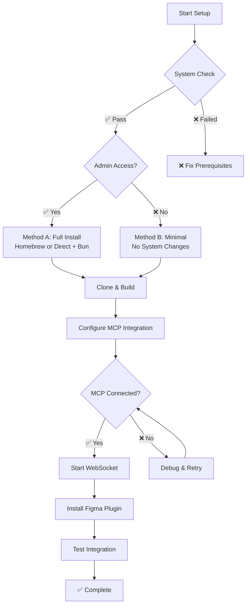

## 🎯 Objective

Install and configure Figma Edit MCP with **AI-agent-friendly decision trees** and fail-safe checkpoints at each step. This guide covers cloning the repository, installing dependencies, configuring MCP for your AI coding assistant, and connecting the Figma plugin.

### 🤖 For AI Agents Reading This Guide

This guide is **specifically designed for AI agents** to understand, parse, and execute setup instructions autonomously. Each section includes:

- **Clear boolean decision points** for branching logic
- **Explicit command verification steps** with expected outputs
- **Fallback strategies** when primary methods fail
- **Environment-specific instructions** based on system capabilities
- **Checkpoint validations** before proceeding to next steps

**AI Agent Instructions**:
1. Execute each command and verify the expected output
2. Follow the branching logic based on system environment
3. If any step fails, use the provided fallback methods
4. Always validate checkpoints before continuing
5. **CRITICAL**: Create and update visual progress tracking using Mermaid diagrams at each major checkpoint

---

## 🌟 Core Principles for AI Agents

When operating Figma Edit MCP, keep these three core principles in mind to maximize your effectiveness:
- 🛡️ **Safer:** The plugin performs strict programmatic checks and protections that the Figma Desktop app lacks (e.g., verifying variable consumers before deletion). Use these validations to protect designs from hallucinations and ensure zero collateral damage.
- ✨ **Cleaner:** Before making multiple changes, always perform a thorough search to ensure you have identified all relevant nodes, then present the full list of changes to the user for approval. This way ensures that you never skip or miss nodes during large updates, ensuring that the design file is always consistent.
- ⚡ **Faster:** Execute batch operations (like bulk text replacement or instance override propagation) to reduce hours of tedious manual changes down to seconds.

## Product Strategy: The Tripartite System

To understand your role in this ecosystem, remember that Figma Edit MCP operates as a synergistic system consisting of 3 parts: **The Plugin**, **You (The LLM)**, and **The Human Designer**.

1. **The Plugin (Execution & Protection):** It enforces strict programmatic checks and protections to prevent mistakes. It acts as the ultimate safeguard.
2. **You, The LLM (Scale & Orchestration):** You process and interpret massive quantities of design data for arbitrary, dynamic updates. You translate the designer's intent into exhaustive execution, ensuring no node is missed.
3. **The Designer (UX Expertise):** The human designer provides the creative direction and UX expertise that neither you nor the plugin possess.

Your job is to leverage your data processing capabilities within the Plugin's safety constraints, so the Designer can focus entirely on creative choices without worrying about execution logistics.

---

## 🛡️ Hallucination Safeguards — Rules for AI Agents

**Read this section before executing any Figma commands.**  
These are hard constraints enforced by the plugin at execution time. They exist specifically to prevent AI agents from damaging designs through hallucinated or stale node references. Violating them will result in denied operations — the plugin will not execute the command.

### 1. Scope is locked at connection time

The user sets an editable scope when the Figma plugin connects. You cannot modify anything outside that scope, and you cannot change or extend the scope programmatically.

- If the user connected **without** a HTTP link to a Figma Page/Layer, the entire session is **read-only**. No write commands will succeed.
- If the user connected **with** a HTTP link to a Figma Page/Layer, writes are permitted only within that node and its child nodes.
  
  **Example:**
  - User connects with `https://www.figma.com/design/12345/My-File?node-id=100-200`
  - The editable scope is now the node with ID `100:200` and all its child nodes
  - You can modify nodes within this scope, but not nodes outside it
  - You cannot change or extend the scope programmatically  
  
<br>
  
To get a HTTP Link to a Figma **Page**, your user will have to follow the following steps:
1. In Figma Desktop App, open the Figma file
2. Right click on the page name in the Pages section on the left sidebar
3. Click on "Copy link to page"
4. Paste the link in the Link to Selection field in the Figma Edit MCP plugin  
  
<br>

To get a HTTP Link to a Figma **Layer**, your user will have to follow the following steps:
1. In Figma Desktop App, open the Figma file
2. Right click on the Layer name in the Layers section on the left sidebar
3. Click on "Copy/Paste as" -> "Copy link to selection"
4. Paste the link in the Link to Selection field in the Figma Edit MCP plugin  

<br>
  
**Error Response guide:**

| Error received | What it means | What to do |
|---|---|---|
| `READ_ONLY_MODE` | Session is read-only | Inform the user. Only read commands are available. |
| `OUTSIDE_SCOPE` | Target node is outside the locked scope | Do not retry with the same ID. Inform the user. |
| `PARENT_OUTSIDE_SCOPE` | Creation target parent is outside scope | The parent you specified is not in the editable tree. |
| `CLONING_SOURCE_NODE_OUTSIDE_SCOPE` | Cloning source node is outside editable scope | Do not retry with the same ID. Inform the user. |

### 2. Every write command requires name verification

All modification tools require a `nodeName` parameter. All creation tools require a `parentNodeName` parameter. Multi-node batch tools require a name on each individual item in the array. The plugin looks up the real name by ID and rejects the operation if it does not match.

**How to get the correct name:**  
Read the node first via `get_nodes_info` or `get_document_info`. Use the `name` field from the response verbatim. Do not guess, abbreviate, or fabricate node names.

**Name x ID Mismatch Response Guide:**

| Error received | What it means | What to do |
|---|---|---|
| `NAME_MISMATCH` | `nodeName` does not match the actual name of `nodeId` | Your context is stale or the ID is wrong. Call `get_nodes_info` to refresh, then retry with the correct ID and name. |
| `PARENT_NAME_MISMATCH` | `parentNodeName` does not match the actual name of `parentId` | Same as above — refresh context before retrying. |

### 3. Do not assume anything about selection state

There are no tools that read or act on "current selection." All tools require explicit node IDs. Never assume you know which node is selected in Figma — always discover nodes through `get_document_info` or `get_nodes_info`.

### 4. Node IDs from Figma URLs work as-is

Figma URLs contain node IDs with dashes (e.g., `20485-41`). The MCP server converts these to colon format (`20485:41`) automatically before forwarding to the plugin. Pass URL-format IDs through unchanged.

### 5. Batch tools verify every item individually

Tools like `delete_multiple_nodes`, `set_multiple_text_contents`, `set_multiple_annotations`, and `set_instance_overrides` run scope and name checks on each item in the array. A single invalid item fails the entire operation. Validate each item's ID and name before calling.

---

## 📋 System Environment Detection

**CRITICAL FOR AI AGENTS**: Execute these detection commands and use results for branching decisions.

```bash
# System Detection Commands - Execute ALL and store results
echo "=== SYSTEM ENVIRONMENT DETECTION ==="

# 1. Operating System Check
OS_TYPE=$(uname -s)
echo "OS_TYPE: $OS_TYPE"

# 2. Shell Type Detection
echo "SHELL_TYPE: $SHELL"

# 3. Homebrew Availability
HOMEBREW_AVAILABLE=$(which brew >/dev/null 2>&1 && echo "YES" || echo "NO")
echo "HOMEBREW_AVAILABLE: $HOMEBREW_AVAILABLE"

# 4. Node.js Availability
NODE_AVAILABLE=$(which node >/dev/null 2>&1 && echo "YES" || echo "NO")
if [ "$NODE_AVAILABLE" = "YES" ]; then
    NODE_VERSION=$(node --version 2>/dev/null || echo "UNKNOWN")
    echo "NODE_VERSION: $NODE_VERSION"
fi

# 5. Bun Availability
BUN_AVAILABLE=$(which bun >/dev/null 2>&1 && echo "YES" || echo "NO")
if [ "$BUN_AVAILABLE" = "YES" ]; then
    BUN_VERSION=$(bun --version 2>/dev/null || echo "UNKNOWN")
    echo "BUN_VERSION: $BUN_VERSION"
fi

# 6. Git Availability
GIT_AVAILABLE=$(which git >/dev/null 2>&1 && echo "YES" || echo "NO")
if [ "$GIT_AVAILABLE" = "YES" ]; then
    GIT_VERSION=$(git --version 2>/dev/null || echo "UNKNOWN")
    echo "GIT_VERSION: $GIT_VERSION"
fi

# 7. Admin/Sudo Access Check
SUDO_AVAILABLE=$(sudo -n true 2>/dev/null && echo "YES" || echo "NO")
echo "SUDO_AVAILABLE: $SUDO_AVAILABLE"

echo "=== DETECTION COMPLETE ==="
```

## 📊 AI Agent Progress Tracking Templates

**MANDATORY FOR AI AGENTS**: Use these Mermaid templates to show progress at each checkpoint.

### 🎯 Progress Status Template

Use these exact status indicators:
- ✅ **COMPLETED** - Step finished successfully
- 🔄 **CURRENT** - Currently executing this step
- ⏳ **PENDING** - Not started yet
- ❌ **FAILED** - Step failed, needs attention
- ⚠️ **WARNING** - Step completed with warnings

### 📋 Standard Progress Tracking Template

**AI AGENTS MUST CREATE THIS DIAGRAM** after environment detection and update it at each checkpoint:

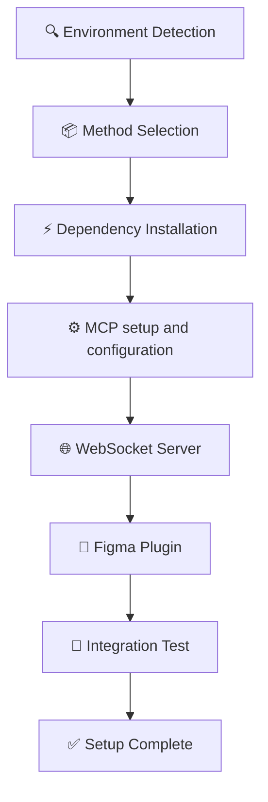

### 🎨 How to Update Progress Status

**AI Agents must use this exact format** at each checkpoint:

```
## 📊 Current Progress Status

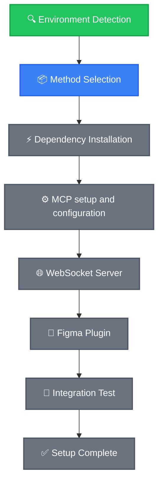


### 🛠️ Method-Specific Progress Templates

#### For Method A (Full Installation):
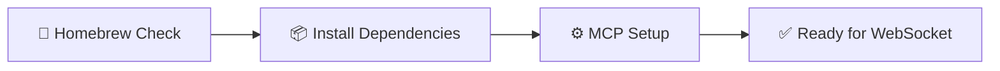

#### For Method B (Minimal Setup):
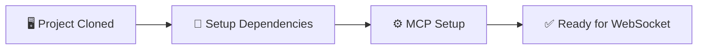

### 📍 Mandatory Progress Update Points

**AI Agents MUST update progress diagram at these checkpoints:**

1. **After Environment Detection** (Step 1)
2. **After Method Selection** (Step 2)
3. **After Dependency Installation** (Step 3)
4. **After MCP Setup and Configuration** (Step 4)
5. **After WebSocket Start** (Step 5)
6. **After Figma Plugin Install** (Step 6)
7. **After Integration Test** (Step 7)
8. **Final Completion** (Step 8)

### 🤖 AI Agent Progress Update Commands

**Use these exact commands at each checkpoint:**

```
CHECKPOINT [STEP_NUMBER]: [STEP_NAME]

Please create/update the progress tracking diagram to show:
- Current step: [STEP_NAME]
- Status: [✅ COMPLETED / 🔄 CURRENT / ❌ FAILED]
- Next step: [NEXT_STEP_NAME]
- Any warnings or issues encountered

Update the Mermaid diagram with appropriate class assignments and show the overall progress percentage.
```

### 🤖 AI Agent Decision Logic

Based on the detection results above, AI agents should follow this decision tree:

```bash
# AI Agent Decision Variables (set based on detection above)
HOMEBREW_AVAILABLE="YES"  # or "NO"
NODE_AVAILABLE="YES"      # or "NO"
BUN_AVAILABLE="YES"       # or "NO"
GIT_AVAILABLE="YES"       # or "NO"
SUDO_AVAILABLE="YES"      # or "NO"
```

**Decision Tree**:
- IF `HOMEBREW_AVAILABLE="YES"` AND `SUDO_AVAILABLE="YES"` → **Method A1: Homebrew Installation**
- ELIF `SUDO_AVAILABLE="YES"` AND `HOMEBREW_AVAILABLE="NO"` → **Method A2: Direct Installation**
- ELIF `GIT_AVAILABLE="YES"` AND `SUDO_AVAILABLE="NO"` → **Method B: Minimal Setup**
- ELSE → **Error: Insufficient System Access**

## 🛡️ Method Selection Based on Environment

### 🌟 Method A1: Homebrew Installation (Recommended)
**Conditions**: `HOMEBREW_AVAILABLE="YES"` AND `SUDO_AVAILABLE="YES"`
- Uses Homebrew package manager
- Cleanest dependency management
- Best for macOS systems with Homebrew

### 🔧 Method A2: Direct Installation
**Conditions**: `SUDO_AVAILABLE="YES"` AND `HOMEBREW_AVAILABLE="NO"`
- Direct installation without package manager
- For systems without Homebrew but with admin access
- Manual dependency management

### 📱 Method B: Minimal Setup
**Conditions**: `GIT_AVAILABLE="YES"` AND `SUDO_AVAILABLE="NO"`
- No system-wide installations required
- Assumes Bun is already available or can be installed without admin
- For restricted environments

---

## 🚀 Method A1: Homebrew Installation

### 📊 Progress Tracking for Method A1

**AI AGENTS**: Start by creating initial progress diagram:

```
CHECKPOINT 1: STARTING METHOD A1 - HOMEBREW INSTALLATION

Please create the Method A1 progress tracking diagram:

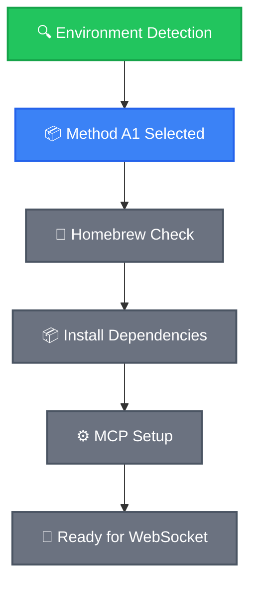
```

### Prerequisites Check for Method A1
```bash
# Verify Homebrew functionality
brew --version && echo "✅ Homebrew functional" || echo "❌ ERROR: Homebrew broken"

# Check brew permissions
brew doctor && echo "✅ Homebrew healthy" || echo "⚠️ WARNING: Homebrew has issues"
```

### Step A1.1: Install Dependencies via Homebrew

```bash
# Update Homebrew first
brew update

# Install Node.js if not available
if [ "$NODE_AVAILABLE" = "NO" ]; then
    echo "Installing Node.js via Homebrew..."
    brew install node
    NODE_AVAILABLE="YES"
    NODE_VERSION=$(node --version)
    echo "✅ Node.js installed: $NODE_VERSION"
else
    echo "✅ Node.js already available: $NODE_VERSION"
fi

# Install Bun if not available
if [ "$BUN_AVAILABLE" = "NO" ]; then
    echo "Installing Bun via Homebrew..."
    brew install bun
    BUN_AVAILABLE="YES"
    BUN_VERSION=$(bun --version)
    echo "✅ Bun installed: $BUN_VERSION"
else
    echo "✅ Bun already available: $BUN_VERSION"
fi

# Verify installations
echo "=== DEPENDENCY VERIFICATION ==="
node --version && echo "✅ Node.js working"
bun --version && echo "✅ Bun working"
git --version && echo "✅ Git working"
```

**CHECKPOINT A1.1**: All dependencies must show ✅ before proceeding.

**AI AGENTS**: Update progress after dependency installation:

```
CHECKPOINT 2: DEPENDENCIES INSTALLED

Update Method A1 progress - mark Homebrew Check and Dependencies as completed:

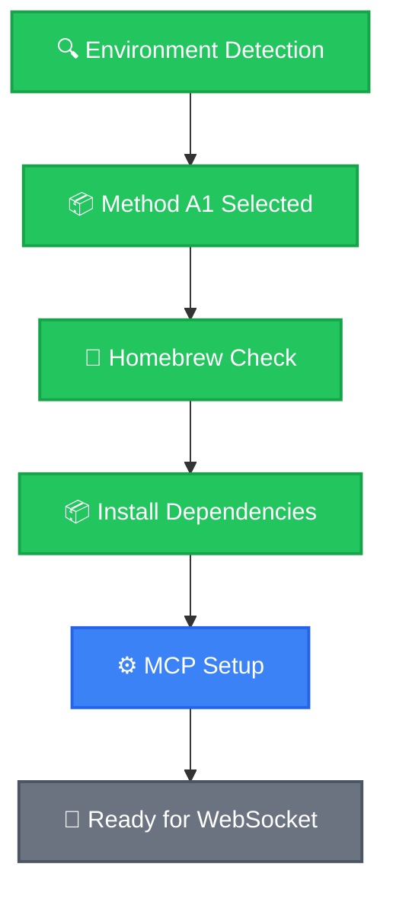
```

### Step A1.2: Clone, Build, and Configure MCP

```bash
# Clone the repository
git clone https://github.com/neozhehan/figma-edit-mcp.git
cd figma-edit-mcp

# Verify project structure
ls package.json src && echo "✅ Project structure valid" || echo "❌ ERROR: Invalid project structure"

# Install dependencies and build
bun install
bun run build

# Run setup (installs deps, builds MCP server and Figma plugin)
bun setup && echo "✅ Setup complete" || echo "❌ ERROR: Setup failed"
```

**AI AGENTS**: Update progress after Method A1 completion:

```
CHECKPOINT 3: METHOD A1 COMPLETE

Method A1 fully completed, ready for common steps:

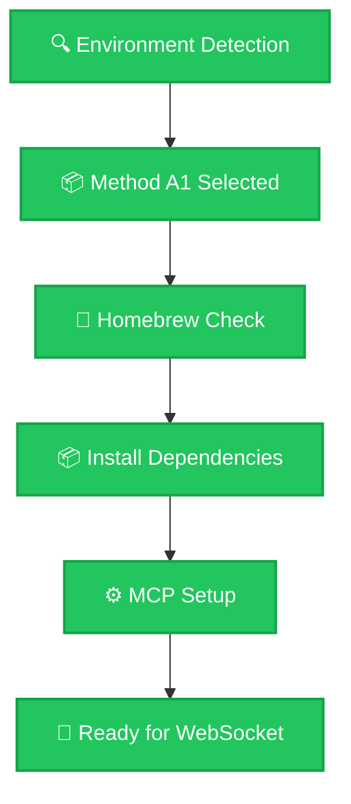

Progress: Method A1 100% Complete ✅ - Proceeding to Common Steps
```

**Continue to Common Steps below.**

---

## 🔧 Method A2: Direct Installation

### 📊 Progress Tracking for Method A2

**AI AGENTS**: Start by creating Method A2 progress diagram:

```
CHECKPOINT 1: STARTING METHOD A2 - DIRECT INSTALLATION

Please create the Method A2 progress tracking diagram:

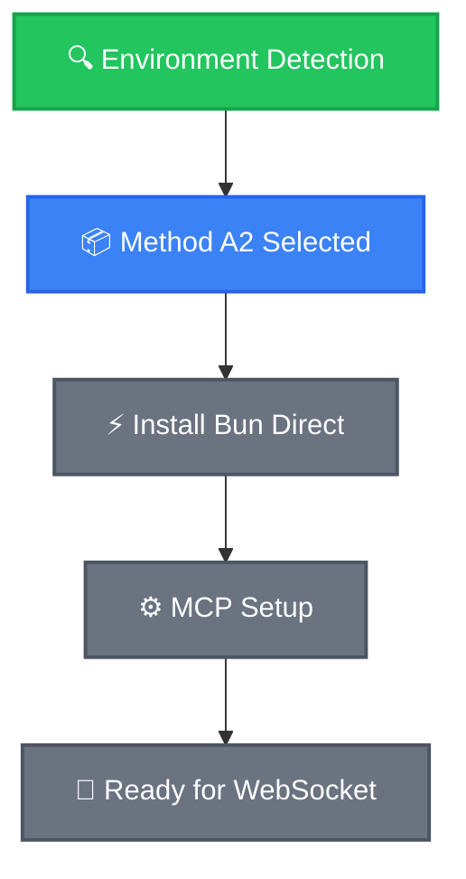
```

### Prerequisites Check for Method A2
```bash
# Verify we have sudo access but no Homebrew
[ "$SUDO_AVAILABLE" = "YES" ] && echo "✅ Sudo access confirmed" || exit 1
[ "$HOMEBREW_AVAILABLE" = "NO" ] && echo "✅ Direct installation path confirmed" || echo "⚠️ Homebrew available, consider Method A1"
```

### Step A2.1: Install Bun Directly

```bash
# Install Bun directly (requires internet access)
curl -fsSL https://bun.sh/install | bash

# Reload shell environment
if [[ "$SHELL" == *"zsh"* ]]; then
    source ~/.zshrc 2>/dev/null || echo "⚠️ No .zshrc found"
    echo "🐚 Using Zsh shell"
elif [[ "$SHELL" == *"bash"* ]]; then
    source ~/.bashrc 2>/dev/null || source ~/.bash_profile 2>/dev/null || echo "⚠️ No .bashrc or .bash_profile found"
    echo "🐚 Using Bash shell"
fi

# Verify installation
bun --version && echo "✅ Bun installed successfully" || echo "❌ ERROR: Bun installation failed"
BUN_AVAILABLE="YES"
BUN_VERSION=$(bun --version)
```

**AI AGENTS**: Update progress after Bun installation:

```
CHECKPOINT 2: BUN INSTALLED DIRECTLY

Update Method A2 progress - Bun installation completed:

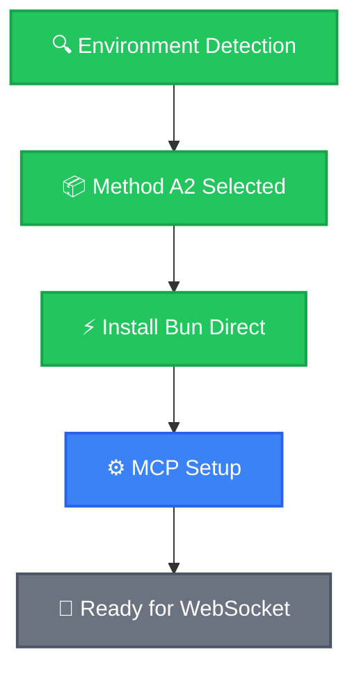
```

### Step A2.2: Clone, Build, and Configure MCP

```bash
# Clone the repository
git clone https://github.com/neozhehan/figma-edit-mcp.git
cd figma-edit-mcp

# Verify and setup
ls package.json src && echo "✅ Project structure valid" || echo "❌ ERROR: Invalid project structure"
bun install
bun run build
bun setup && echo "✅ Setup complete" || echo "❌ ERROR: Setup failed"
```

**AI AGENTS**: Update progress after Method A2 completion:

```
CHECKPOINT 3: METHOD A2 COMPLETE

Method A2 fully completed, ready for common steps:

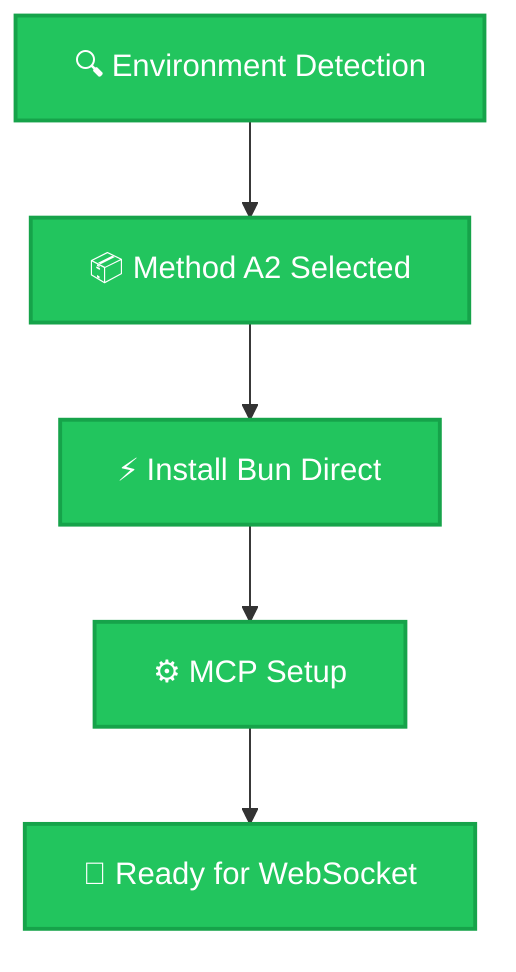

Progress: Method A2 100% Complete ✅ - Proceeding to Common Steps
```

**Continue to Common Steps below.**

---

## 📱 Method B: Minimal Setup

### 📊 Progress Tracking for Method B

**AI AGENTS**: Start by creating Method B progress diagram:

```
CHECKPOINT 1: STARTING METHOD B - MINIMAL SETUP

Please create the Method B progress tracking diagram:

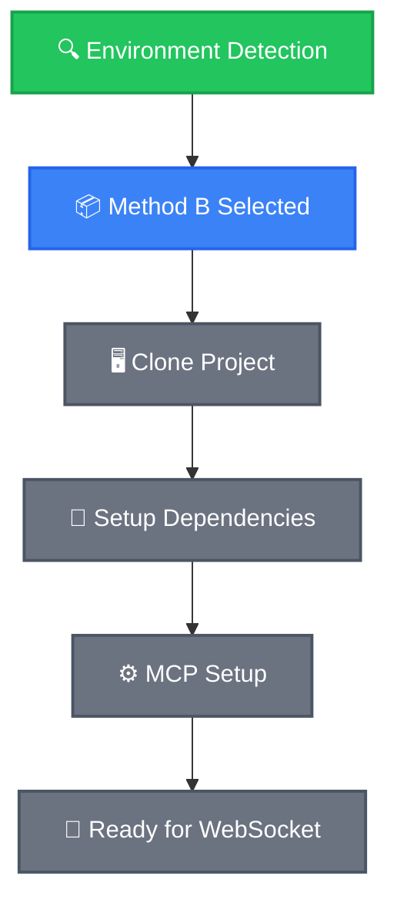
```

### Prerequisites Check for Method B
```bash
# Verify minimal setup conditions
[ "$GIT_AVAILABLE" = "YES" ] && echo "✅ Git available" || echo "❌ ERROR: Install Git first"
[ "$BUN_AVAILABLE" = "YES" ] && echo "✅ Bun available" || echo "⚠️ WARNING: Bun not found — install it before continuing"
```

### Step B.1: Clone and Verify Project

```bash
# Clone the repository
git clone https://github.com/neozhehan/figma-edit-mcp.git
cd figma-edit-mcp

# Verify project structure
ls package.json src && echo "✅ Project structure valid" || echo "❌ ERROR: Invalid project structure"
```

### Step B.2: Setup Dependencies

```bash
# Install dependencies and build
bun install
bun run build
bun setup && echo "✅ Setup complete" || echo "❌ ERROR: Setup failed"
```

**AI AGENTS**: Update progress after project setup:

```
CHECKPOINT 2: PROJECT CLONED AND BUILT

Update Method B progress - project setup completed:

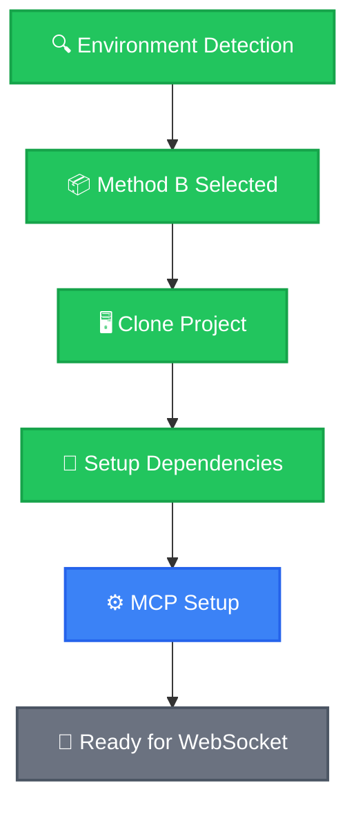
```

### Step B.3: Configure MCP Integration

Open the project directory in your IDE, then run the integration script:

```bash
bun integrate
```

Follow the interactive menu to select your AI coding assistant integration.

**📖 CRITICAL FOR AI AGENTS**: After running the integrate command, verify the MCP configuration was created for your chosen integration. Refer to the manual configuration table in the readme.md for the expected config file locations.

**AI AGENTS**: Update progress after Method B completion:

```
CHECKPOINT 3: METHOD B COMPLETE

Method B fully completed, ready for common steps:

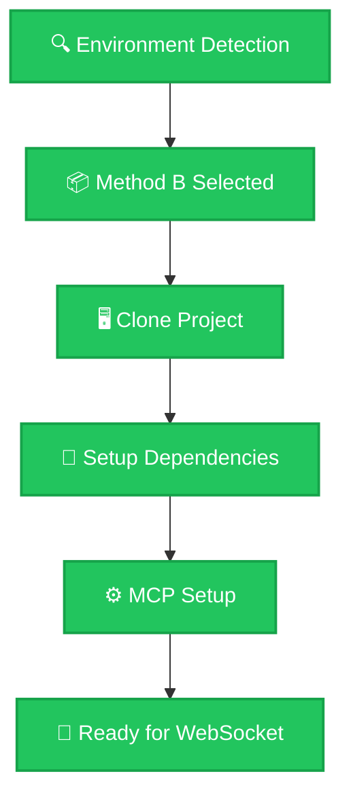

Progress: Method B 100% Complete ✅ - Proceeding to Common Steps
```

**Continue to Common Steps below.**

---

## 🔗 Common Steps (All Methods)

### Step C.1: Verify MCP Configuration

**🚨 CRITICAL FOR AI AGENTS**: Verify the project is properly built and the MCP configuration exists.

```bash
# Verify current directory
pwd | grep "figma-edit-mcp" && echo "✅ Correct directory" || echo "❌ ERROR: Wrong directory"

# Verify project structure
ls package.json src && echo "✅ Project structure valid" || echo "❌ ERROR: Invalid project structure"

# Verify the dist output exists
test -f dist/server.js && echo "✅ MCP server built" || echo "❌ ERROR: Run 'bun run build' first"

# Run integrate if not already done
echo "💡 If you haven't run 'bun integrate' yet, do so now to configure your AI assistant."
```

**CHECKPOINT C.1**: Verify in your AI coding assistant's settings that "FigmaEdit" shows as connected. For Cursor, open Settings (`Cmd+,` on Mac, `Ctrl+,` on Windows/Linux) and search "MCP".

**AI AGENTS**: Update overall progress after MCP configuration:

```
CHECKPOINT 3: MCP SETUP AND CONFIGURATION COMPLETE

Update overall progress - MCP setup and configured:

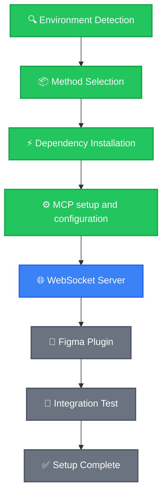

Progress: 50% Complete - MCP Configured ✅ - Starting WebSocket Server
```

### Step C.2: Start WebSocket Server

To ensure stability and easy monitoring, run the WebSocket server in the foreground. This dedicates a terminal to the server, confirms it's always running, and saves all logs to a file for later review.

**How to Start and Monitor the Server:**

1.  **Start the Server**: Open a new terminal in your IDE and run the following command. The terminal will become unresponsive, which means the server is running correctly.
    ```bash
    # Runs the server in the foreground and saves all logs to websocket.log
    bun socket > websocket.log 2>&1
    ```

2.  **Monitor Logs**: To see server activity, open a *second* terminal and use this command for a live feed of the logs:
    ```bash
    tail -f websocket.log
    ```
    You can also simply open the `websocket.log` file to view its contents.

3.  **Stop the Server**: To stop the server, go to its dedicated terminal window and press `Ctrl + C`.

**CHECKPOINT C.2**: The server terminal should be active (and unresponsive). You should see a "WebSocket server running on port 3055" message at the beginning of the `websocket.log` file. **Keep the server terminal open.**

### 🔍 Verify WebSocket Server Status

**🚨 CRITICAL FOR AI AGENTS**: Use your IDE's terminal monitoring to verify WebSocket server status:

1. **Check Active Terminals**:
   - Verify you can see the WebSocket server terminal running
   - Confirm the server shows "WebSocket server running on port 3055" message

2. **Verify Server is Active**:
   ```bash
   # In a new terminal (don't close the WebSocket terminal!)
   curl -I http://localhost:3055 2>/dev/null && echo "✅ WebSocket server responding" || echo "❌ Server not responding"

   # Check port status
   lsof -i :3055 && echo "✅ Port 3055 in use by WebSocket server" || echo "❌ Port 3055 not in use"
   ```

3. **Monitor Server Logs**:
   - Keep the WebSocket terminal visible
   - Watch for connection messages when the Figma plugin connects
   - Server logs will show plugin connection status in real-time

**⚠️ IMPORTANT**: Do NOT close the WebSocket terminal — it must stay running throughout the entire Figma integration session.

**AI AGENTS**: Update progress after WebSocket server start:

```
CHECKPOINT 4: WEBSOCKET SERVER RUNNING

Update progress - WebSocket server successfully started:

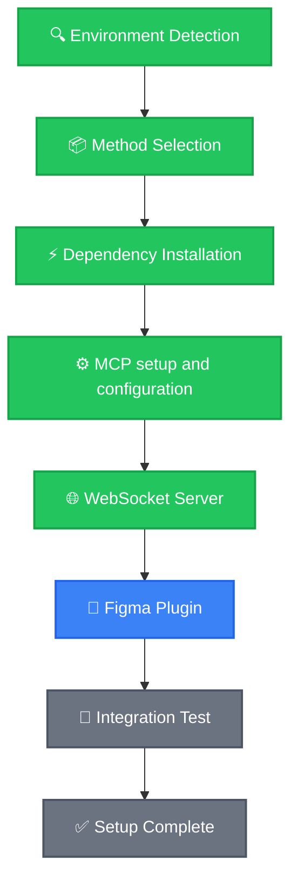

Progress: 63% Complete - WebSocket Running ✅ - Installing Figma Plugin
```

### Step C.3: Install and Configure Figma Plugin

#### 🔌 Install the Plugin Locally

1. **Register the plugin with Figma**:
   - In Figma Desktop, go to `Plugins` → `Development` → `New Plugin`
   - Choose **"Link existing plugin"**
   - Select the `src/figma_plugin/manifest.json` file from the cloned repository
   - The plugin will now appear in your Figma development plugins

2. **Open Figma and Run the Plugin**:
   - Open any Figma file (or create a new one)
   - Go to `Plugins` menu → `Figma Edit MCP Plugin`
   - The plugin panel will open

#### ⚙️ Configure Plugin to Connect to Local WebSocket

**🚨 CRITICAL**: The plugin needs to connect to your local WebSocket server:

1. **In the Plugin Panel**:
   - Look for **"WebSocket URL"** or **"Server URL"** setting
   - Change the URL from default to: `ws://localhost:3055`
   - Click **"Connect"** or **"Save"** to apply the setting

2. **Verify Connection**:
   - The plugin should show **"Connected"** status
   - You should see a green indicator or success message in the plugin

#### 📡 Monitor Connection Status

**🔍 IMPORTANT FOR AI AGENTS**: Verify the plugin connection via WebSocket server logs:

1. **Check WebSocket Server Logs**:
   - Look at the WebSocket server terminal or `websocket.log`
   - When the plugin connects successfully, you should see log messages like:
     ```
     ✓ Client joined channel "..." (2 total clients)
     ```

2. **Connection Troubleshooting**:
   - If no connection messages appear in server logs, the plugin is not connecting properly
   - Check that WebSocket URL in plugin is set to `ws://localhost:3055`
   - Verify the WebSocket server is still running
   - Try refreshing the Figma page and reconnecting the plugin

**AI AGENTS**: Update progress after Figma plugin installation:

```
CHECKPOINT 5: FIGMA PLUGIN INSTALLED

Update progress - Figma plugin successfully installed:

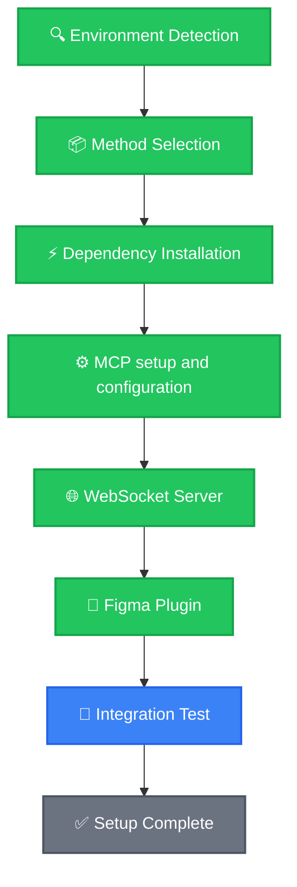

Progress: 75% Complete - Plugin Installed ✅ - Running Integration Tests
```

### Step C.4: Test Integration

#### 🧪 Test MCP Commands in Your AI Assistant

**In your AI coding assistant (where MCP is connected):**

```bash
# Test 1: MCP Connection
join_channel
# Expected: "Successfully joined channel" message

# Test 2: Figma Communication
get_document_info
# Expected: JSON data from Figma document
```

#### 📋 Verify Complete Integration

**🔍 FINAL VERIFICATION FOR AI AGENTS**:

1. **Check All Active Processes**:
   - Verify the WebSocket server terminal is still running with "WebSocket server running on port 3055"
   - Verify connection logs showing the Figma plugin is connected
   - Verify the MCP status showing FigmaEdit as connected in your IDE

2. **Test End-to-End Communication**:
   ```bash
   # In your AI assistant, test these MCP commands:
   get_document_info
   get_nodes_info
   ```
   - Commands should return JSON data from your Figma document
   - Check WebSocket server logs — they should show command activity
   - Figma plugin should show activity/response indicators

3. **Integration Status Checklist**:
   - ✅ WebSocket server running (visible in terminal)
   - ✅ Figma plugin connected (connection logs in server terminal)
   - ✅ MCP commands working (returns Figma data)
   - ✅ No error messages in any terminals

**CHECKPOINT C.4**: All tests must pass and terminals should show healthy connections for successful setup.

**AI AGENTS**: Update progress after successful integration test:

```
CHECKPOINT 6: SETUP COMPLETE - INTEGRATION SUCCESSFUL

🎉 FINAL STATUS - All components working perfectly:

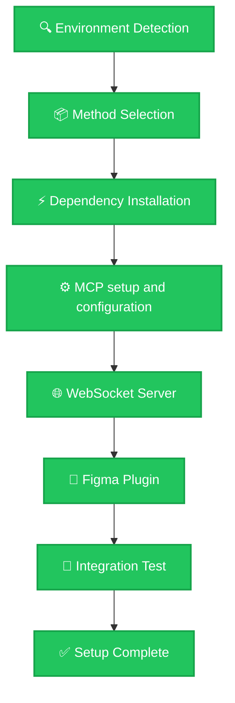

🎯 **FINAL RESULT**: 100% Complete ✅
- ✅ Environment Detection Complete
- ✅ Method Successfully Executed
- ✅ Dependencies Installed
- ✅ Project Cloned & Configured
- ✅ MCP Connected
- ✅ WebSocket Server Running
- ✅ Figma Plugin Active
- ✅ Integration Tests Passed
- ✅ **READY TO USE!**

**🚀 AI Agent can now assist with Figma design tasks!**
```

---

## 🔍 AI Agent Troubleshooting Decision Tree

### Issue: Prerequisites Failed
```bash
# Decision tree for prerequisite failures
if [ "$GIT_AVAILABLE" = "NO" ]; then
    echo "❌ CRITICAL: Install Git first"
    exit 1
else
    echo "✅ Prerequisites satisfied, continue setup"
fi
```

### Issue: MCP Not Connected
```bash
# AI Agent debugging steps
echo "🔍 Debugging MCP connection..."

# Check if in correct project directory
if [ ! -f "package.json" ] || [ ! -d "src" ]; then
    echo "❌ Not in project directory"
    echo "💡 Please ensure you're in the figma-edit-mcp directory"
    exit 1
fi

# Check if dist/server.js was built
if [ ! -f "dist/server.js" ]; then
    echo "⚠️ MCP server not built — running build..."
    bun run build
fi

# Check if integrate was run
echo "💡 Run 'bun integrate' and select your AI assistant integration."
echo "💡 After configuring, restart your AI coding assistant to reload MCP."
```

### Issue: WebSocket Connection Failed
```bash
# AI Agent network debugging
echo "🔍 Debugging WebSocket connection..."

# Step 1: Check current terminal state for WebSocket server
echo "💡 Verify WebSocket server is running in a terminal"

# Check if port is in use
if lsof -i :3055 >/dev/null 2>&1; then
    echo "⚠️ Port 3055 in use, killing existing process"
    lsof -ti:3055 | xargs kill -9 2>/dev/null || true
    sleep 2
fi

# Restart WebSocket server based on available runtime
if [ "$BUN_AVAILABLE" = "YES" ]; then
    echo "🚀 Starting WebSocket server with Bun..."
    bun socket
elif [ "$NODE_AVAILABLE" = "YES" ]; then
    echo "🚀 Starting WebSocket server with Node..."
    npm run socket || npx bun socket
else
    echo "❌ No suitable runtime for WebSocket server"
    exit 1
fi

echo "💡 After starting server, verify it shows 'WebSocket server running on port 3055'"
```

### Issue: Figma Plugin Not Connecting
```bash
# AI Agent plugin debugging
echo "🔍 Debugging Figma plugin connection..."

echo "💡 Check WebSocket server logs for connection attempts from Figma plugin"

# Common plugin connection issues:
echo "🔧 Plugin Connection Checklist:"
echo "1. Plugin WebSocket URL set to 'ws://localhost:3055'"
echo "2. WebSocket server running (check terminal)"
echo "3. Figma plugin installed and activated"
echo "4. No firewall blocking localhost:3055"

echo "💡 In Figma plugin panel:"
echo "- Verify connection URL is 'ws://localhost:3055'"
echo "- Click disconnect/reconnect if needed"
echo "- Check for error messages in plugin"
```

### Issue: Runtime Not Found
```bash
# AI Agent runtime fallback logic
echo "🔍 Attempting runtime fallback..."

if [ "$HOMEBREW_AVAILABLE" = "YES" ] && [ "$SUDO_AVAILABLE" = "YES" ]; then
    echo "Installing missing runtime via Homebrew..."
    brew install bun node
elif [ "$SUDO_AVAILABLE" = "YES" ]; then
    echo "Installing Bun directly..."
    curl -fsSL https://bun.sh/install | bash
    source ~/.zshrc 2>/dev/null || source ~/.bashrc 2>/dev/null || true
else
    echo "❌ Cannot install runtime in restricted environment"
    echo "💡 Bun must be available to run this project"
    exit 1
fi
```

---

## ✅ AI Agent Success Verification Matrix

**AI Agents should verify ALL conditions before marking setup as complete:**

### Environment Verification
```bash
echo "=== FINAL VERIFICATION MATRIX ==="

# System Environment
[ "$OS_TYPE" != "" ] && echo "✅ OS Detection: $OS_TYPE" || echo "❌ OS Detection Failed"

# Required Tools
[ "$GIT_AVAILABLE" = "YES" ] && echo "✅ Git Available" || echo "❌ Git Missing"

# Runtime Environment
if [ "$BUN_AVAILABLE" = "YES" ]; then
    echo "✅ Bun Runtime: $BUN_VERSION"
elif [ "$NODE_AVAILABLE" = "YES" ]; then
    echo "✅ Node.js Runtime: $NODE_VERSION"
else
    echo "❌ No Suitable Runtime Found"
fi

# Project Setup
[ -f "dist/server.js" ] && echo "✅ MCP Server Built" || echo "❌ MCP Server Not Built"
[ -f "package.json" ] && echo "✅ Project Structure Valid" || echo "❌ Invalid Project"

# Process Status
if lsof -i :3055 >/dev/null 2>&1; then
    echo "✅ WebSocket Server Running (Port 3055)"
else
    echo "❌ WebSocket Server Not Running"
fi
```

### Functional Verification
**Execute in your AI assistant with MCP connected:**

1. **MCP Connection Test**: `join_channel` → Should return success message
2. **Figma Communication Test**: `get_document_info` → Should return JSON data
3. **Plugin Status**: Figma plugin should show as connected

### 🎉 Success Criteria
**ALL of the following must be true:**
- ✅ Environment detection completed without errors
- ✅ Appropriate method selected and executed based on system capabilities
- ✅ Project successfully cloned and configured
- ✅ MCP server built (`dist/server.js` exists)
- ✅ MCP integration configured via `bun integrate`
- ✅ MCP shows "FigmaEdit" as connected in your AI assistant
- ✅ WebSocket server running on port 3055
- ✅ Figma plugin installed, configured with `ws://localhost:3055`, and connected
- ✅ Plugin connection visible in WebSocket server logs
- ✅ `join_channel` command works
- ✅ `get_document_info` returns Figma document data
- ✅ All processes healthy and running

**If any criterion fails, AI agents should follow the troubleshooting decision tree above.**

---

## 🚀 AI Agent Quick Commands

### Clone and Setup
```bash
# Clone the repository
git clone https://github.com/neozhehan/figma-edit-mcp.git
cd figma-edit-mcp

# Install and build everything
bun setup

# Configure your AI assistant integration
bun integrate
```

### Alternative One-Line Commands (For Advanced Users)
```bash
# Method A1 (Homebrew)
[ "$HOMEBREW_AVAILABLE" = "YES" ] && cd ~/Desktop && git clone https://github.com/neozhehan/figma-edit-mcp.git && cd figma-edit-mcp && brew install bun && bun setup

# Method A2 (Direct)
[ "$SUDO_AVAILABLE" = "YES" ] && cd ~/Desktop && git clone https://github.com/neozhehan/figma-edit-mcp.git && cd figma-edit-mcp && curl -fsSL https://bun.sh/install | bash && source ~/.zshrc && bun setup

# Method B (Minimal)
[ "$GIT_AVAILABLE" = "YES" ] && cd ~/Desktop && git clone https://github.com/neozhehan/figma-edit-mcp.git && echo "✅ Project cloned to ~/Desktop/figma-edit-mcp" && echo "💡 Open this folder in your IDE and run 'bun setup' followed by 'bun integrate'"
```

### Service Management
```bash
# Start WebSocket Server (foreground, recommended)
bun socket

# Start WebSocket Server (background, with log file)
nohup bun socket > websocket.log 2>&1 & echo $! > websocket.pid

# Stop WebSocket Server (if running in background)
[ -f websocket.pid ] && kill $(cat websocket.pid) && rm websocket.pid

# Check Service Status
ps aux | grep -E "(bun socket|node.*socket)" || echo "WebSocket server not running"

# Monitor logs (when running with log redirect)
tail -f websocket.log
```

**Remember**: Always keep the WebSocket server running for the Figma plugin to communicate with your AI assistant.
